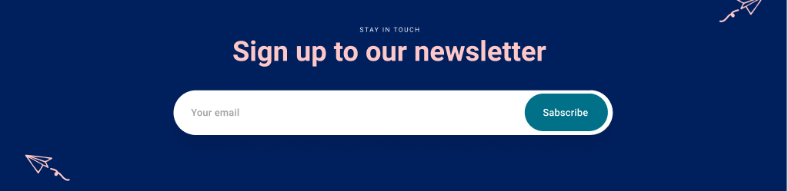

# webdev_sem2

section.head>(div.head__eye.head__eye--opened+div.head__eye.head__eye--closed+div.head__mouth)

section.body>(div.body__arm.body__arm--up+div.body__arm.body__arm--down+div.body__chest)

section.leg>(div.leg__knee+div.leg__shin+div.leg__foot)

header.header>((a.header__logo>img.header__img)+(nav.header__nav.navigation>(ul.navigation__list>(li.navigation__item*3)))+button.header__btn)

form.form>(label.form__label>(span.form__span+input.form__input)+button.form__submit)

ul.cards__list>li.cards__item.card>(img.card__img+span.card__tag+h3.card__title+span.card__date)

section.elevator>(h2.elevator__title+p.elevator__text+a.elevator__link)
